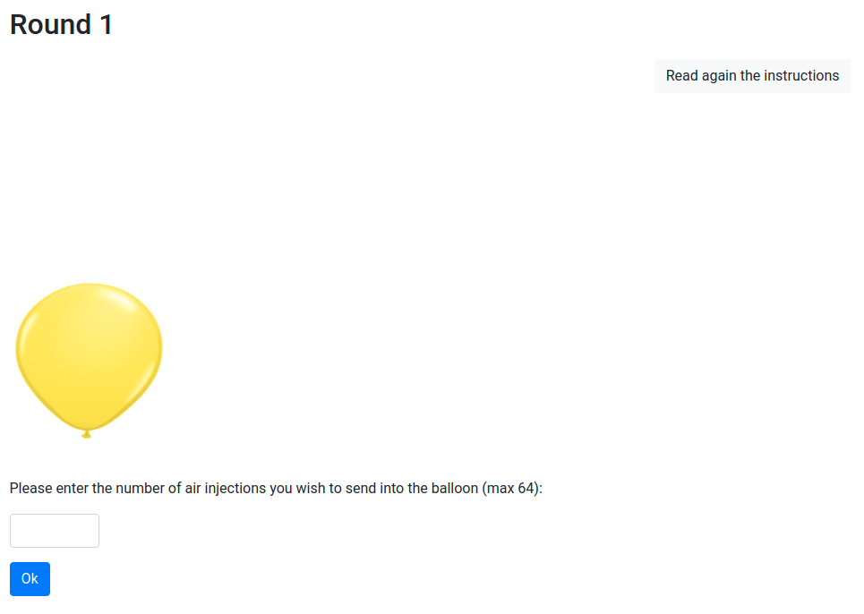
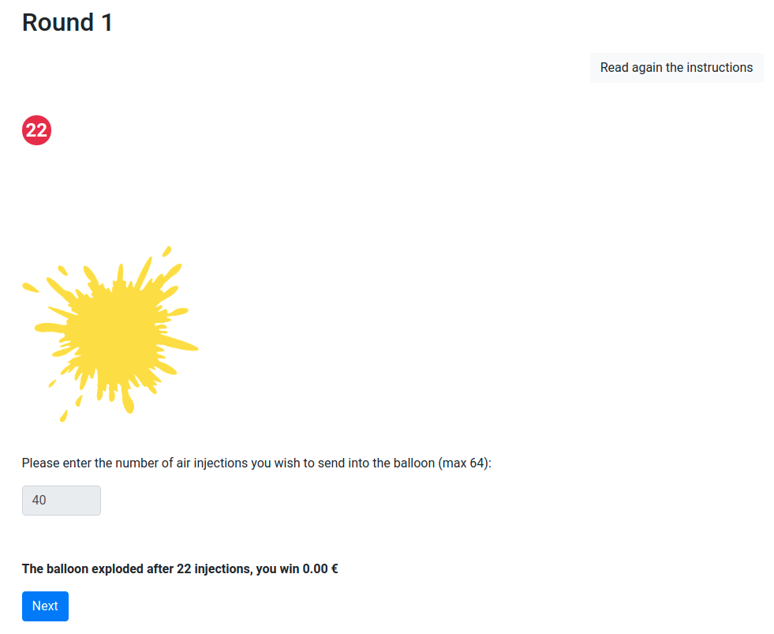
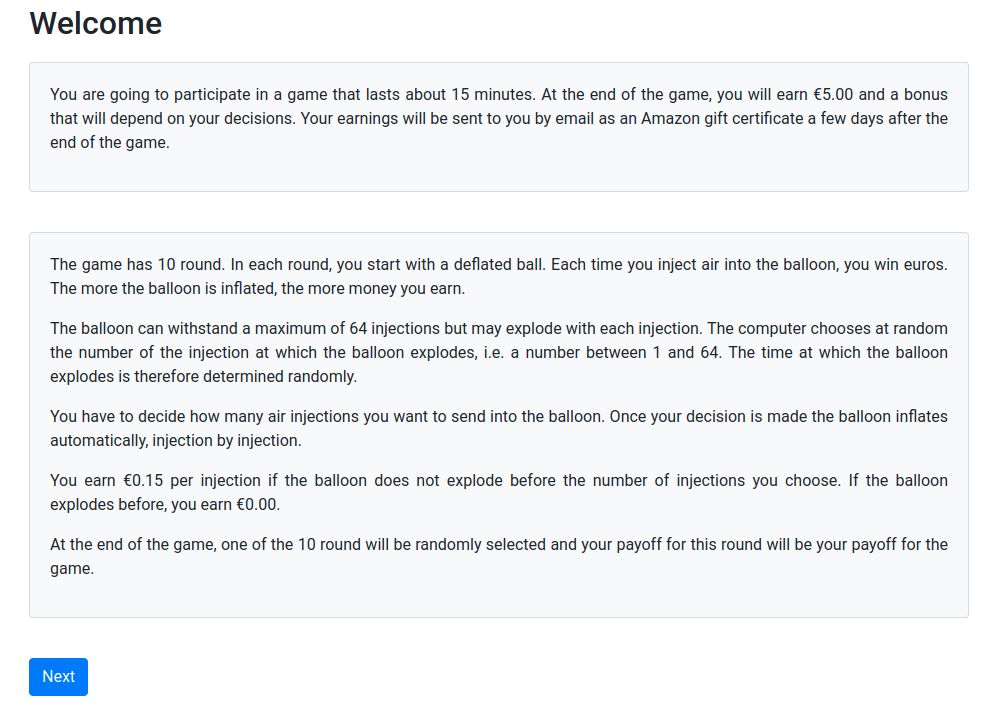
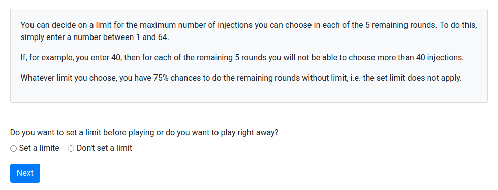
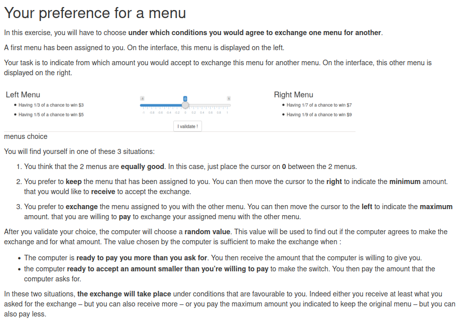
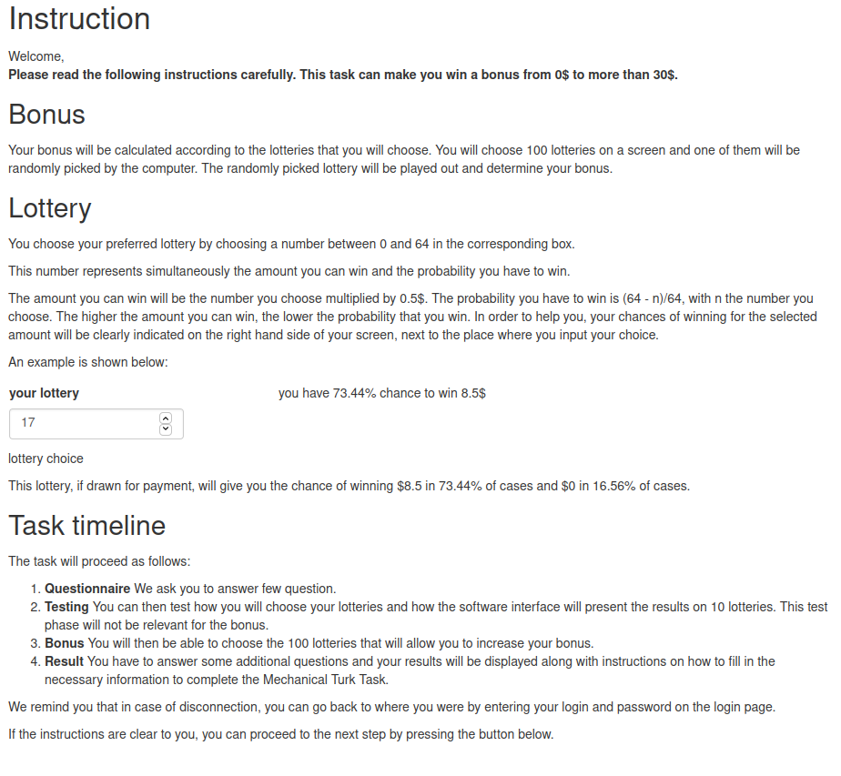

# References {-}

<div id="refs"></div>

# (APPENDIX) Appendix {-} 

# Experimental instruction for chapter 2 {#expe-instruc2}

```{r, echo=FALSE, out.width='90%'}

```

```{r, echo=FALSE, out.width='90%'}

```

```{r, echo=FALSE, out.width='90%'}

```


```{r, echo=FALSE, out.width='90%'}

```

```{r, echo=FALSE, out.width='90%'}

```


# Experimental instruction for chapter 3 {#expe-instruc3}

Instruction of the experiment are display as follow:

```{r, echo=FALSE, out.width='90%'}

```

```{r, echo=FALSE, out.width='90%'}

```

```{r, echo=FALSE, out.width='90%'}

```

# Experimental instruction for chapter 4 {#expe-instruc4}

Instruction of the experiment are display as follow:

```{r, echo=FALSE, out.height='120%', out.width='90%'}

```

